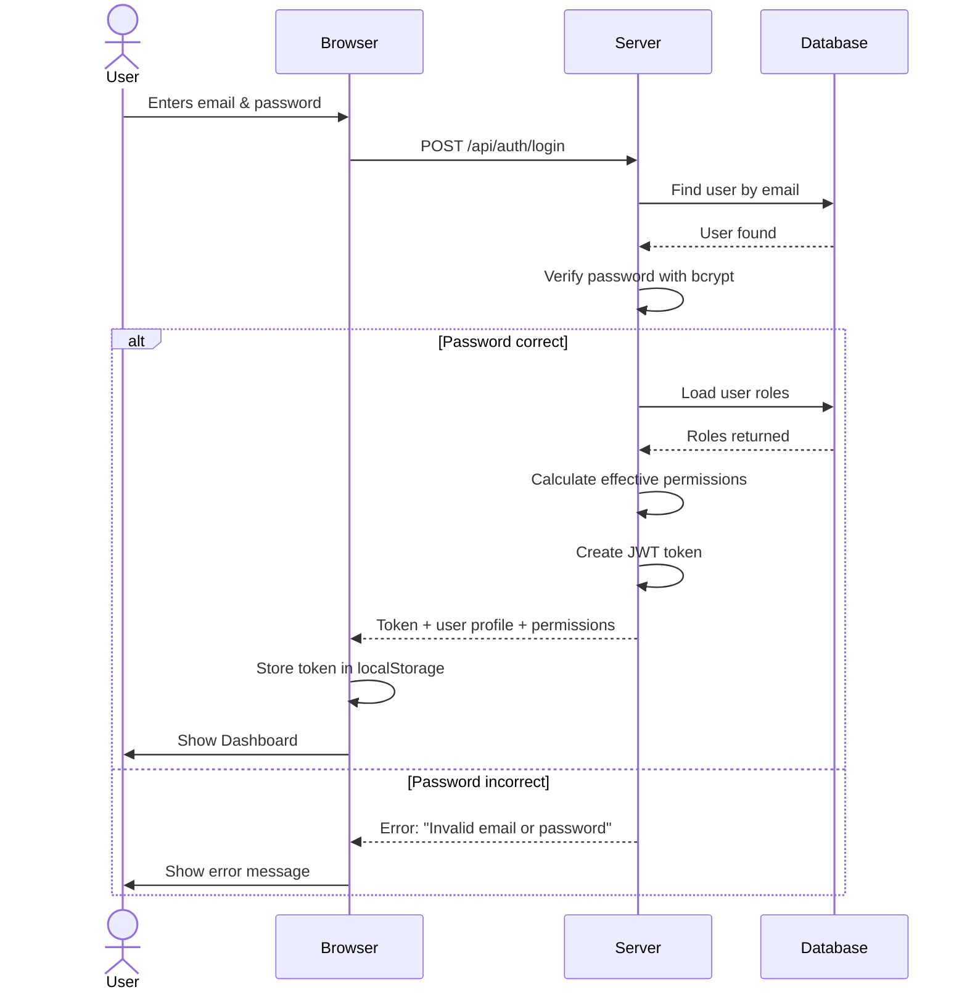
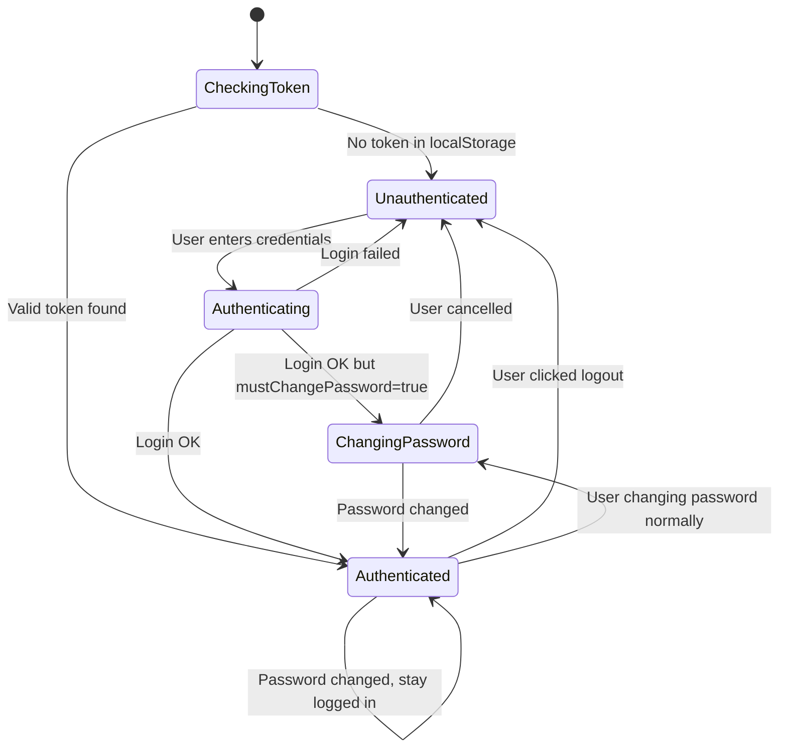
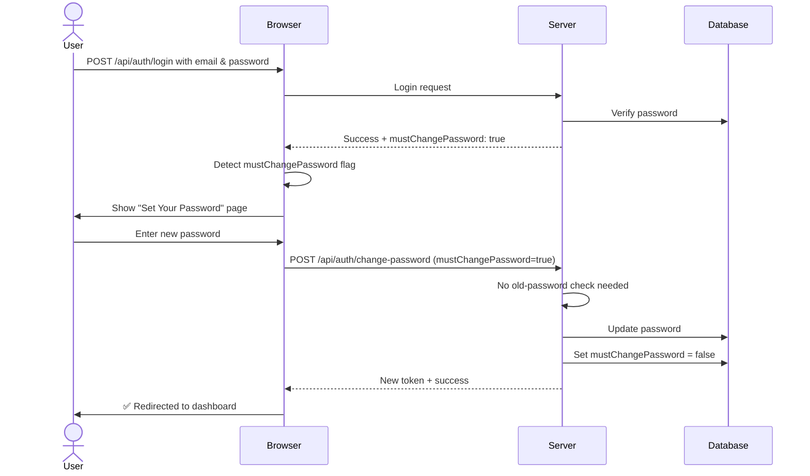
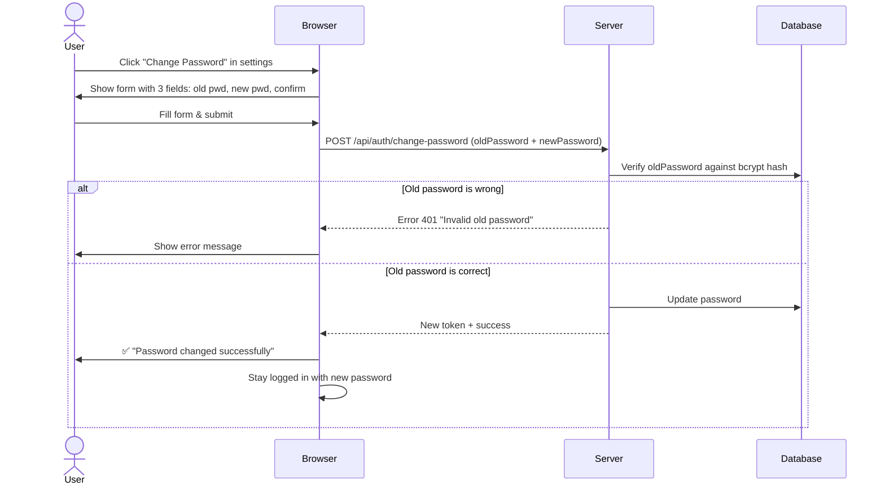
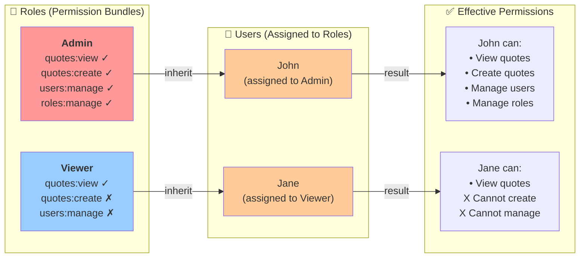
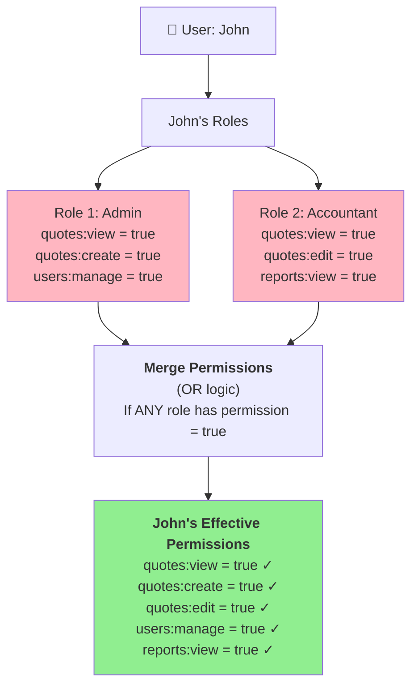
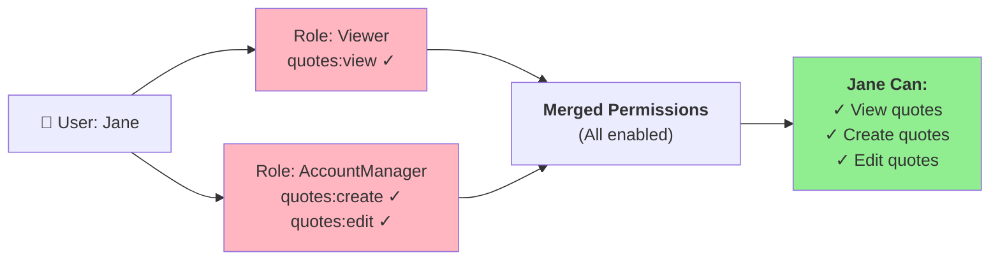
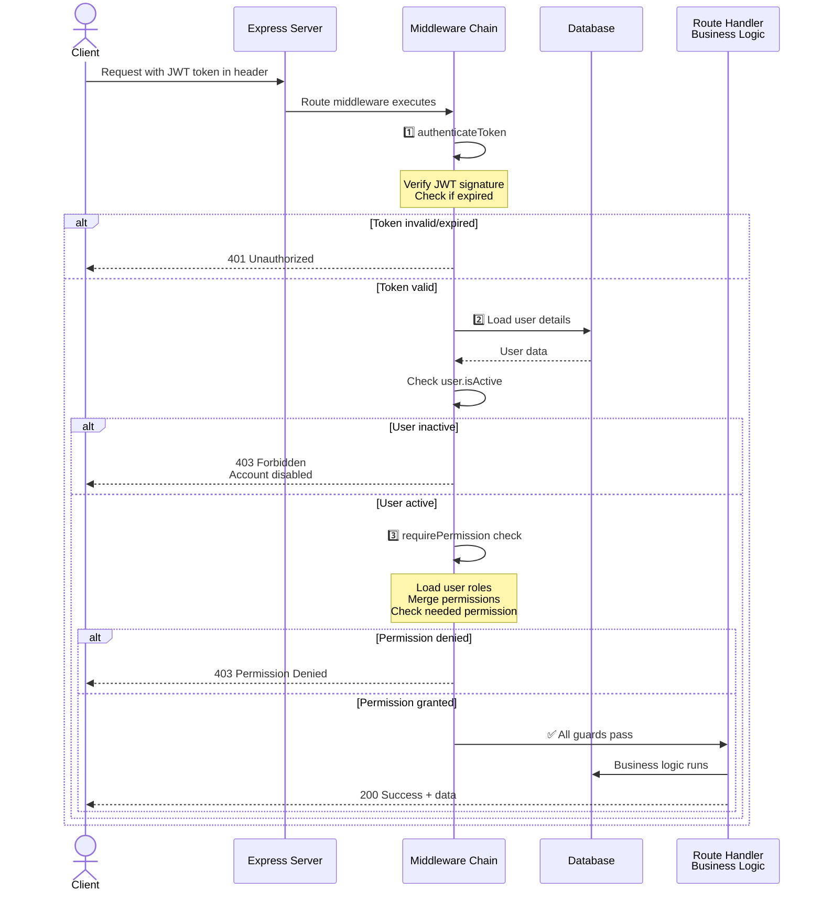
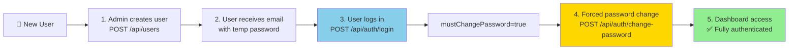
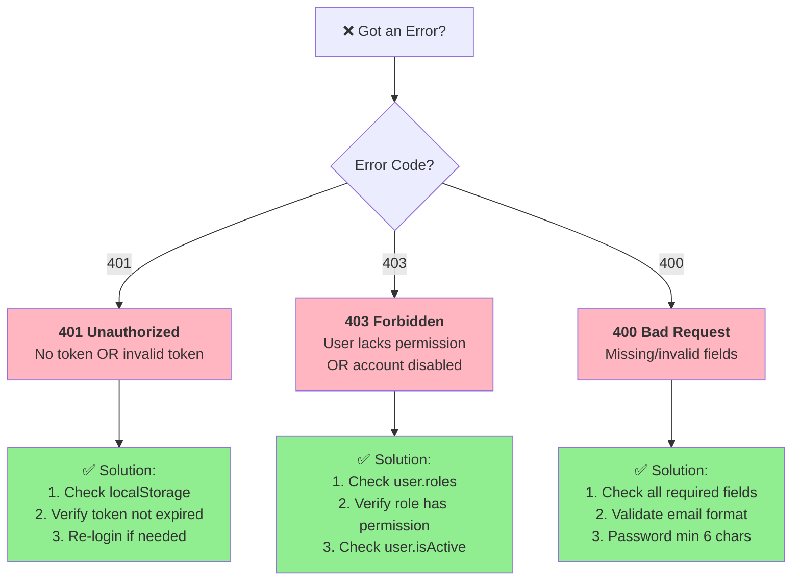

# Authentication & RBAC Documentation

> **For New Developers:** This document explains how users log in, change passwords, and get access to features based on their role. Read sections 1–3 to understand the basics.

## Quick Reference

| Need | Look Here | Use | 
|------|-----------|-----|
| Login flow | Section 1 | See sequence diagram |
| Client auth state | Section 2 | See state diagram |
| Password change | Section 3 | See two workflows |
| Roles & permissions | Section 4 | See role inheritance |
| Protecting routes | Section 5 | Use middleware pattern |
| API endpoints | Section 5 | Reference table |
| Client permission checks | Section 6 | `hasPermission()` |
| Complete architecture | Section 10 | See system diagram |
| Troubleshooting | Section 11 | See error tree |

## Quick Concepts

- **Authentication** = Who are you? (Login with email + password)
- **Authorization** = What can you do? (Permissions based on your role)
- **JWT Token** = A signed proof of login, sent with every request
- **Role** = A group of permissions (e.g., "Admin", "Viewer")
- **User** = A person assigned to one or more roles, inherits all permissions from those roles

---

## 1. How Login Works (Simple Version)

### Visual Flow



**What Gets Returned:**
```json
{
  "token": "eyJhbGc...[long jwt token]...",
  "user": {
    "email": "user@eastman.local",
    "fullName": "John Doe",
    "roles": ["Admin"],
    "mustChangePassword": false,
    "effectivePermissions": {
      "quotes:view": true,
      "quotes:create": true,
      "users:manage": false
    }
  }
}
```

**Why JWT Token?** It proves you're logged in without storing your password. The token expires after 24 hours for security.


---

## 2. How Authentication Works in React (Client Side)

### Visual State Flow



**What Each State Means:**

| State | What Shows | What User Sees |
|-------|-----------|-----------------|
| `Unauthenticated` | Login page | Email + password input |
| `Authenticating` | Loading spinner | "Checking credentials..." |
| `ChangingPassword` | Forced password change page | New password input (first login) |
| `Authenticated` | Dashboard | Calculators, admin panel, etc. |

### How to Use AuthContext

```javascript
import { useAuth } from "./context/AuthContext";

function App() {
  const { authState, user, login, logout, hasPermission } = useAuth();
  
  // Route based on auth state
  if (authState === "unauthenticated") {
    return <LoginPage />;
  }
  
  if (authState === "changingPassword") {
    return <ChangePasswordPage />;
  }
  
  return <Dashboard />;
}

// Use in any component to check permissions
function UserManagement() {
  const { hasPermission } = useAuth();
  
  return (
    <>
      {hasPermission('users:manage') && (
        <button>Create User</button>
      )}
    </>
  );
}
```

**Available Functions:**
- `login(email, password)` — Call when user submits login form
- `logout()` — Call when user clicks "Log Out"
- `hasPermission(key)` — Returns `true` if user has permission


---

## 3. Password Change (Two Scenarios)

### Visual: Forced Change (First Login)



### Visual: Normal Change (After First Login)




---

## 4. Roles & Permissions (RBAC)

### The Idea (Visual)



**Key Insight:** Don't assign permissions to individual users. Assign users to roles, and roles have permissions. Much easier to manage!

### How It Works

1. **Role Definition** (`server/models/Role.js`):
   ```javascript
   {
     name: "Admin",
     permissions: {
       "quotes:view": true,
       "quotes:create": true,
       "quotes:edit": true,
       "users:manage": true,
       "roles:manage": true
     }
   }
   ```

2. **User Assignment** (`server/models/User.js`):
   ```javascript
   {
     email: "john@eastman.local",
     roles: [ObjectId_of_Admin_role],  // ← User linked to Admin role
     effectivePermissions: { ... }     // ← Calculated when user logs in
   }
   ```

3. **Permission Calculation** (Visual)



**Merging Rule:** If a user has multiple roles, they get a permission if **ANY** of their roles grant it.

4. **Permission Check** (In every API route):
   ```javascript
   // Only logged-in users who have "users:manage" can access this
   router.post('/users', authenticateToken, requirePermission('users:manage'), handler);
   ```

### Multiple Roles Example

A user can have multiple roles. Permissions are merged (OR logic):




---

## 5. How the Server Protects Routes

### Request Inspection Journey (Visual)



**Guards in Order:**
1. **authenticateToken** — Is the JWT valid?
2. **Check isActive** — Is the user account active?
3. **requirePermission** — Does the user have this permission?

### Code Example: Protecting Routes

**File:** `server/routes/users.js`

```javascript
// Only admins can create users
router.post('/users',
  authenticateToken,                    // ← Guard 1
  requirePermission('users:manage'),    // ← Guard 2
  (req, res) => {
    // Handler only runs if both guards pass
    const newUser = await createUser(req.body);
    res.json(newUser);
  }
);

// Only admins can manage roles
router.put('/roles/:id',
  authenticateToken,
  requirePermission('roles:manage'),
  (req, res) => { /* ... */ }
);

// Anyone logged in can view their quotes (no permission check needed)
router.get('/quotes',
  authenticateToken,  // ← Only guard
  (req, res) => { /* ... */ }
);
```

**Why:** Consistent middleware pattern protects all routes automatically.


   - If no → return 403 "Permission denied"
  ↓
✅ Request reaches handler (business logic)
```

### Example: Protecting a Route

**File:** `server/routes/users.js`

```javascript
// Only admins can create new users
router.post('/users', 
  authenticateToken,              // ← Guard 1: Is user logged in?
  requirePermission('users:manage'),  // ← Guard 2: Does user have this permission?
  (req, res) => {
    // Business logic only runs if both guards pass
    const newUser = await createUser(req.body);
    res.json(newUser);
  }
);

// Only admins can manage roles
router.put('/roles/:id',
  authenticateToken,
  requirePermission('roles:manage'),
  (req, res) => {
    // ...
  }
);

// Anyone logged in can view their own quotes (no special permission needed)
router.get('/quotes',
  authenticateToken,  // ← Only guard: user must be logged in
  (req, res) => {
    // ...
  }
);
```

**Why:** This pattern is applied consistently across all routes.


---

## 5. API Endpoints Reference

### Visual: Common Authentication Workflows



### Authentication Endpoints

| Method | Endpoint | Auth | Permission | Description |
|--------|----------|------|------------|-------------|
| `POST` | `/api/auth/login` | None | None | Login with email + password |
| `POST` | `/api/auth/change-password` | JWT | None | Change password (forced or normal) |
| `GET` | `/api/auth/me` | JWT | None | Get current user profile + effectivePermissions |
| `POST` | `/api/auth/logout` | JWT | None | Logout (client-side token removal) |

### User Management Endpoints

| Method | Endpoint | Auth | Permission | Description |
|--------|----------|------|------------|-------------|
| `GET` | `/api/users` | JWT | `users:manage` | List all users with role hydration |
| `POST` | `/api/users` | JWT | `users:manage` | Create user with role assignment |
| `GET` | `/api/users/:id` | JWT | `users:manage` | Get user with roles + effectivePermissions |
| `PUT` | `/api/users/:id` | JWT | `users:manage` | Update user (email, name, roles, isActive) |
| `DELETE` | `/api/users/:id` | JWT | `users:manage` | Delete user |
| `POST` | `/api/users/:id/reset-password` | JWT | `users:manage` | Admin reset password (sets mustChangePassword=true) |

### Roles Management Endpoints

| Method | Endpoint | Auth | Permission | Description |
|--------|----------|------|------------|-------------|
| `GET` | `/api/roles` | JWT | `roles:manage` | List all roles with user counts |
| `POST` | `/api/roles` | JWT | `roles:manage` | Create new role with permissions |
| `GET` | `/api/roles/:id` | JWT | `roles:manage` | Get role details + assigned users |
| `PUT` | `/api/roles/:id` | JWT | `roles:manage` | Update role permissions |
| `DELETE` | `/api/roles/:id` | JWT | `roles:manage` | Delete role (reassign users first) |

---

## 6. Client-Side RBAC UI

### 6.1 Permission Gates in React

**File:** `client/src/context/AuthContext.jsx`

```javascript
// Hook to check permission
const { hasPermission } = useAuth();

// In component:
{hasPermission('users:manage') && (
  <button onClick={() => navigate('/admin/users')}>
    Manage Users
  </button>
)}
```

### 6.2 Sidebar Navigation with Permission Gates

**File:** `client/src/components/layout/Sidebar/SidebarNav.jsx`

```javascript
// Only show admin section if user has permission
{hasPermission('users:manage') || hasPermission('roles:manage') ? (
  <div className="nav-section">
    <h3>Admin</h3>
    <NavItem icon={Users} label="Users" view="users" />
    <NavItem icon={Shield} label="Roles" view="roles" />
  </div>
) : null}
```

### 6.3 Disabled State for Read-Only Views

**File:** `client/src/components/admin/RoleForm.jsx`

```javascript
// If user has roles:manage but not permissions to edit certain permissions:
<IOSToggle
  on={permission.value}
  onToggle={() => setPermission(!permission.value)}
  disabled={!canEditPermissions}  // Disabled UI, shows permission denied state
/>
```

---

## 7. Event-Driven Sync

### 7.1 Cross-Tab User Updates

**File:** `client/src/constants/events.js`

```javascript
export const USERS_UPDATED_EVENT = 'users-updated';
export const ROLES_UPDATED_EVENT = 'roles-updated';
```

**Usage in AuthContext:**
```javascript
// When user logs out or role changes:
window.dispatchEvent(new CustomEvent(USERS_UPDATED_EVENT));

// Listeners in other tabs:
window.addEventListener(USERS_UPDATED_EVENT, () => {
  // Refresh user counts in sidebar
  // Re-fetch role list
  // Update permission gates
});
```

### 7.2 Sidebar Badge Updates

**File:** `client/src/hooks/useSidebarBadgeCounts.js`

```javascript
// Listens to USERS_UPDATED_EVENT and ROLES_UPDATED_EVENT
// Updates badge counts showing:
// - Number of saved quotes per calculator
// - Number of users (admin)
// - Number of roles (admin)

useEffect(() => {
  const handleUsersUpdated = () => {
    refreshAdminCounts();  // Re-fetch from API
  };
  
  window.addEventListener(USERS_UPDATED_EVENT, handleUsersUpdated);
  
  return () => window.removeEventListener(USERS_UPDATED_EVENT, handleUsersUpdated);
}, []);
```

---

## 8. Error Handling

### 8.1 Authentication Errors

| Status | Error | Cause | Client Action |
|--------|-------|-------|----------------|
| `400` | "Email is required" | Missing email field | Show validation error |
| `400` | "Password is required" | Missing password field | Show validation error |
| `401` | "Invalid email or password" | Wrong credentials | Show login error toast |
| `409` | "Email already in use" | Duplicate email on signup | Show duplicate error |

### 8.2 Authorization Errors

| Status | Error | Cause | Client Action |
|--------|-------|-------|----------------|
| `401` | "No token provided" | Missing JWT | Redirect to login |
| `401` | "Invalid token" | Expired/malformed JWT | Clear localStorage, redirect to login |
| `403` | "Permission denied: quotes:create" | User lacks required permission | Show forbidden error + redirect to dashboard |
| `403` | "User account is inactive" | User.isActive = false | Show account disabled message |

---

## 9. Security Practices

### 9.1 Password Security

- **Storage:** Bcrypt hashing with salt rounds = 10
- **Validation:** Minimum 6 characters (enforced server-side)
- **Forced Change:** All new users must change password on first login
- **Old Password Verification:** Required for non-forced password changes

### 9.2 Token Security

- **JWT Signature:** Signed with HS256 + `process.env.JWT_SECRET`
- **Expiration:** Tokens expire after 24 hours (configurable)
- **Storage:** Stored in localStorage (vulnerable to XSS — consider httpOnly cookies for production)
- **Transmission:** Sent via Authorization header: `Bearer <token>`

### 9.3 RBAC Security

- **Permission Inheritance:** Users inherit all permissions from all assigned roles
- **No Permission Overlap:** Permission keys are namespaced to prevent collision
- **Active Status:** Inactive users cannot access any endpoints (even with valid token)
- **Role Deletion:** Must reassign users before deleting role (prevents orphaned permissions)

### 9.4 Input Validation

- **Email:** Must be valid format + sparse unique index on DB
- **Password:** Minimum 6 characters + trimmed
- **User Names:** Trimmed, max 100 characters
- **Permission Keys:** Whitelist of known keys only

---

## 10. Data Flow Diagram

```
┌─────────────────────────────────────────────────────────────────┐
│                     CLIENT (React)                              │
│  ┌──────────────────────────────────────────────────────────┐  │
│  │  App.jsx (auth gate)                                     │  │
│  │  - Checks localStorage for token                         │  │
│  │  - Routes to LoginPage or Dashboard                      │  │
│  └──────────────────────────────────────────────────────────┘  │
│         ↑                                          ↓            │
│  ┌──────────────────────────────────────────────────────────┐  │
│  │  AuthContext (useAuth hook)                              │  │
│  │  - Manages token + user state                            │  │
│  │  - Exposes login, logout, changePassword                 │  │
│  │  - Provides hasPermission(key)                           │  │
│  └──────────────────────────────────────────────────────────┘  │
│         ↑                                          ↓            │
│  ┌──────────────────────────────────────────────────────────┐  │
│  │  authApi.js (API client)                                 │  │
│  │  - POST /api/auth/login                                  │  │
│  │  - POST /api/auth/change-password                        │  │
│  │  - GET /api/auth/me                                      │  │
│  └──────────────────────────────────────────────────────────┘  │
└─────────────────────────────────────────────────────────────────┘
                          ↑            ↓
                    JWT in header    JSON response
                          ↑            ↓
┌─────────────────────────────────────────────────────────────────┐
│                     SERVER (Express)                            │
│  ┌──────────────────────────────────────────────────────────┐  │
│  │  Middleware Chain                                        │  │
│  │  1. authenticateToken (verify JWT)                       │  │
│  │  2. requirePermission (check role permissions)           │  │
│  │  3. Handler (business logic)                             │  │
│  └──────────────────────────────────────────────────────────┘  │
│         ↑                                          ↓            │
│  ┌──────────────────────────────────────────────────────────┐  │
│  │  Controllers (auth.js, users.js, roles.js)               │  │
│  │  - Parse req + call services                             │  │
│  │  - Set HTTP status + response shape                      │  │
│  └──────────────────────────────────────────────────────────┘  │
│         ↑                                          ↓            │
│  ┌──────────────────────────────────────────────────────────┐  │
│  │  Services (auth, users, roles)                           │  │
│  │  - Pure business logic                                   │  │
│  │  - Database queries                                      │  │
│  │  - Bcrypt + JWT operations                               │  │
│  └──────────────────────────────────────────────────────────┘  │
│         ↑                                          ↓            │
│  ┌──────────────────────────────────────────────────────────┐  │
│  │  Models (User, Role)                                     │  │
│  │  - Mongoose schemas                                      │  │
│  │  - Indexes (email: sparse+unique)                        │  │
│  │  - Virtual getters (effectivePermissions)                │  │
│  └──────────────────────────────────────────────────────────┘  │
│         ↑                                          ↓            │
│  ┌──────────────────────────────────────────────────────────┐  │
│  │  MongoDB (Atlas)                                         │  │
│  │  - users collection                                      │  │
│  │  - roles collection                                      │  │
│  │  - quotes collection (gravure, flexo, jobcost)          │  │
│  └──────────────────────────────────────────────────────────┘  │
└─────────────────────────────────────────────────────────────────┘
```

---

## 10. Complete System Architecture Diagram

```mermaid
graph TB
    subgraph Client["🖥️ Browser (React)"]
        App["App.jsx<br/>Routes based on authState"]
        AuthCtx["AuthContext<br/>login, logout, hasPermission"]
        LoginUI["LoginPage<br/>ChangePasswordPage"]
        Dashboard["Dashboard<br/>+ Admin UI"]
        Storage["localStorage<br/>token + user"]
    end
    
    subgraph Network["📡 Network"]
        Header["Authorization Header<br/>Bearer {JWT}"]
    end
    
    subgraph Server["🔒 Express Server"]
        Routes["Routes<br/>POST /auth/login<br/>POST /auth/change-password<br/>GET /users, POST /users, etc."]
        Auth["authenticateToken<br/>Verify JWT"]
        Permission["requirePermission<br/>Check roles"]
        Handler["Route Handler<br/>Business Logic"]
    end
    
    subgraph Database["💾 MongoDB"]
        UserCol["Users Collection<br/>email, password, roles[]"]
        RoleCol["Roles Collection<br/>name, permissions{}"]
        QuotesCol["Quotes Collection"]
    end
    
    Client -->|1. POST /login| Network
    Network -->|JWT in header| Server
    Network -->|API request| Server
    
    LoginUI -->|enter credentials| AuthCtx
    AuthCtx -->|login()| Routes
    
    App -->|check authState| AuthCtx
    AuthCtx -->|hasPermission()| Storage
    
    Routes -->|verify| Auth
    Auth -->|check| Permission
    Permission -->|pass| Handler
    
    Handler -->|query| Database
    Handler -->|response| Server
    Server -->|response| Client
    
    Database -->|fetch| UserCol
    Database -->|fetch| RoleCol
    
    style App fill:#87CEEB
    style AuthCtx fill:#87CEEB
    style Auth fill:#FFD700
    style Permission fill:#FFD700
    style Handler fill:#90EE90
    style UserCol fill:#FFB6C1
    style RoleCol fill:#FFB6C1
```

**Key Interactions:**
1. User logs in → Browser sends credentials
2. Server verifies password, creates JWT, returns token
3. Browser stores token in localStorage
4. Every request includes token in Authorization header
5. Server verifies token + checks permissions
6. Only if all guards pass, handler executes

---

## 11. Troubleshooting

### 11.1 "Invalid token" After Login

**Cause:** JWT_SECRET mismatch between server encoding and decoding

**Fix:**
1. Verify `process.env.JWT_SECRET` is same on server
2. Check `.env` file is loaded correctly
3. Restart server after `.env` change

### 11.2 "Permission denied" on Authorized User

**Cause:** Role permissions not granted or role not assigned to user

**Fix:**
1. Check user.roles array includes intended role
2. Verify role has the required permission key (e.g., "quotes:create")
3. Check `requirePermission()` middleware is using correct permission key
4. Use `/api/users/:id` to verify effectivePermissions are computed correctly

### 11.3 "User account is inactive" After Login

**Cause:** User.isActive = false

**Fix:**
1. Admin must set user.isActive = true via PUT `/api/users/:id`
2. Check if admin intended to disable user

### 11.4 Forced Password Change Not Triggering

**Cause:** mustChangePassword flag not set or not checked on client

**Fix:**
1. Verify server returns `mustChangePassword: true` in login response
2. Check AuthContext detects this flag and sets authState = "changingPassword"
3. Verify ChangePasswordPage renders when authState = "changingPassword"

### Error Decision Tree



---

## 12. Future Enhancements

- [ ] Refresh token rotation (shorter access token lifetime + long-lived refresh tokens)
- [ ] Two-factor authentication (2FA)
- [ ] OAuth2 integration (Google, Azure AD)
- [ ] Login audit logs (track failed attempts, IP addresses)
- [ ] Session management (terminate other sessions from account settings)
- [ ] Permission scoping (e.g., "quotes:create:gravure-only")
- [ ] Audit trail for role/permission changes
- [ ] httpOnly cookie storage for tokens (instead of localStorage)
- [ ] Rate limiting on /api/auth/login (prevent brute force)
- [ ] Email verification on user creation

---

**Document Version:** 1.0  
**Last Updated:** May 4, 2026  
**Author:** Development Team
